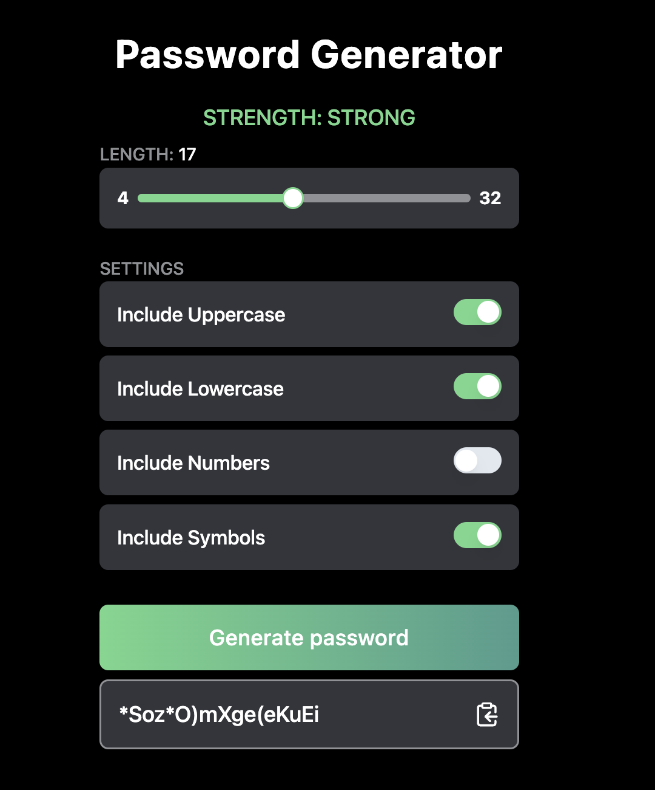
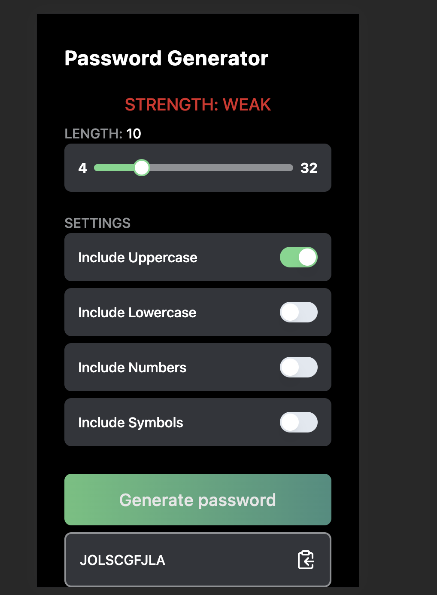

# Password Generator

### 📝 Brief

Your challenge is to build out this password generator app and get it looking as close to the design as possible. Your users should be able to:

- Generate a password based on the selected inclusion options
- Copy the generated password to the computer's clipboard
- See a strength rating for their generated password
- View the optimal layout for the interface depending on their device's screen size

### 🔗 Links

- [Challenge Details](https://www.frontendmentor.io/challenges/password-generator-app-Mr8CLycqjh)
- [Github Repo](https://github.com/jacastanon01/password-generator)
- [Demo](https://password-generator-alpha-azure.vercel.app/)

### Tech stack

